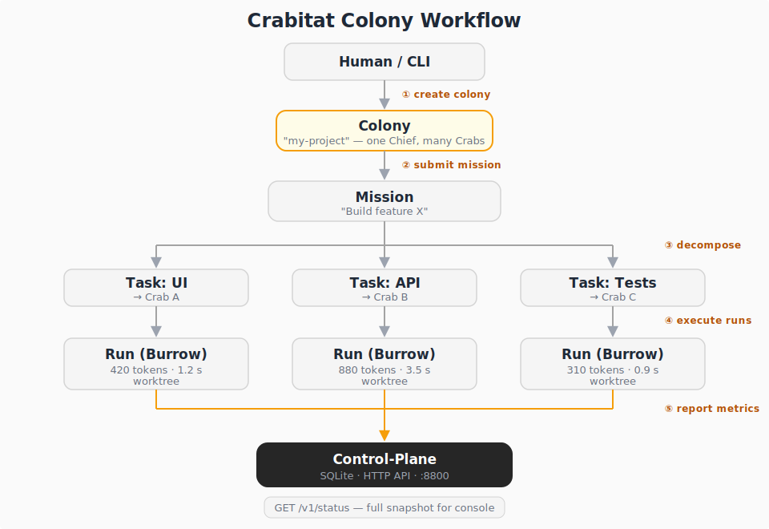

# Crabitat

Crabitat is a colony-based orchestration platform for AI coding agents. It coordinates
multiple **Crabs** (executor agents) under a **Chief** (orchestrator), organized into
**Colonies** (projects), tracking **Missions**, **Tasks**, and **Runs** through a
SQLite-backed control-plane.

## Workflow



## Colony Terminology

| Term       | Description                                                  |
|------------|--------------------------------------------------------------|
| **Colony** | Top-level project grouping — one Chief, many Crabs           |
| **Chief**  | Orchestrator that decomposes missions into tasks             |
| **Crab**   | Executor agent that picks up and runs tasks                  |
| **Mission**| High-level objective submitted to a colony                   |
| **Task**   | Discrete unit of work derived from a mission                 |
| **Run**    | Single execution attempt of a task by a crab                 |
| **Burrow** | Isolated workspace (worktree or external repo) for a run     |

## Quickstart

Prerequisites: [mise](https://mise.jdx.dev/), Rust 1.90+, Node 24+

```bash
# Install toolchain and build
mise install
mise run build

# Start the control-plane (SQLite DB auto-created)
mise run run-control-plane

# In another terminal, create a colony and register a crab
curl -s -X POST http://127.0.0.1:8800/v1/colonies \
  -H 'Content-Type: application/json' \
  -d '{"name":"my-project","description":"My first colony"}'
# note the colony_id from the response, then:
./scripts/onboard-crab.sh <colony_id> crab-1 Alice coder

# Open the console (requires npm install first)
mise run console-install
mise run console-dev
# Visit http://localhost:4321
```

## Workspace Layout

```
crates/
  crabitat-core/           Shared domain types (Colony, Mission, Task, Run, IDs, metrics)
  crabitat-protocol/       Message envelope and protocol payloads
  crabitat-control-plane/  HTTP API + SQLite persistence
  crabitat-chief/          Chief orchestration runtime (skeleton)
  crabitat-crab/           Crab executor runtime (skeleton)
apps/
  crabitat-console/        Astro SSR operations console
scripts/
  onboard-crab.sh          Register a crab via the control-plane API
```

## Control-plane API

Base URL: `http://127.0.0.1:8800` (default)

| Method | Endpoint              | Description                   |
|--------|-----------------------|-------------------------------|
| GET    | /healthz              | Health check                  |
| POST   | /v1/colonies          | Create a colony               |
| GET    | /v1/colonies          | List all colonies             |
| POST   | /v1/crabs/register    | Register or update a crab     |
| GET    | /v1/crabs             | List all crabs                |
| POST   | /v1/missions          | Create a mission              |
| GET    | /v1/missions          | List all missions             |
| POST   | /v1/tasks             | Create a task                 |
| GET    | /v1/tasks             | List all tasks                |
| POST   | /v1/runs/start        | Start a run                   |
| POST   | /v1/runs/update       | Update a run's progress       |
| POST   | /v1/runs/complete     | Complete a run                |
| GET    | /v1/status            | Full status snapshot          |

State is persisted in SQLite (default: `./var/crabitat-control-plane.db`).

## Onboarding Flow

```bash
# 1. Start the control-plane
mise run run-control-plane

# 2. Create a colony (project)
curl -s -X POST http://127.0.0.1:8800/v1/colonies \
  -H 'Content-Type: application/json' \
  -d '{"name":"my-project","description":"Building feature X"}'

# 3. Register crabs into the colony
./scripts/onboard-crab.sh <colony_id> crab-1 Alice coder
./scripts/onboard-crab.sh <colony_id> crab-2 Bob reviewer idle

# Or register via curl directly
curl -s -X POST http://127.0.0.1:8800/v1/crabs/register \
  -H 'Content-Type: application/json' \
  -d '{"crab_id":"crab-3","colony_id":"<colony_id>","name":"Carol","role":"architect"}'
```

## Run Lifecycle

1. **Create a colony** — `POST /v1/colonies` with name and description
2. **Register crabs** — `POST /v1/crabs/register` with crab details and colony_id
3. **Create a mission** — `POST /v1/missions` with prompt and colony_id
4. **Create a task** — `POST /v1/tasks` referencing the mission, optionally assign a crab
5. **Start a run** — `POST /v1/runs/start` with task, crab, and burrow config
6. **Update progress** — `POST /v1/runs/update` with status, progress, token usage, timing
7. **Complete the run** — `POST /v1/runs/complete` with final status, summary, and metrics

Each step updates the crab's state and the task's status automatically.

## mise Commands

| Command                     | Description                              |
|-----------------------------|------------------------------------------|
| `mise run fmt`              | Format all Rust code                     |
| `mise run check`            | Typecheck the workspace                  |
| `mise run clippy`           | Lint the workspace                       |
| `mise run test`             | Run all tests                            |
| `mise run build`            | Build all workspace members              |
| `mise run verify`           | Run fmt + clippy + test                  |
| `mise run run-control-plane`| Start the control-plane on port 8800     |
| `mise run run-chief`        | Start the chief in watch mode            |
| `mise run run-crab`         | Start a crab client                      |
| `mise run console-install`  | Install Astro console dependencies       |
| `mise run console-dev`      | Run console in dev mode (port 4321)      |
| `mise run console-build`    | Build the console for production         |
