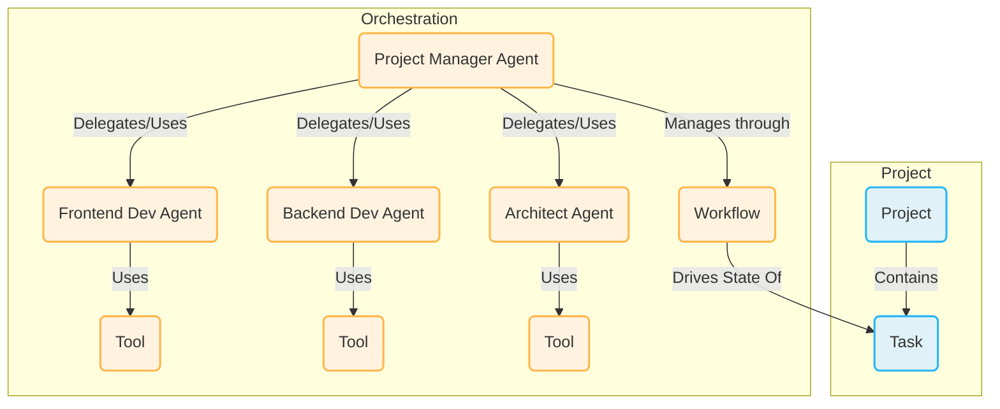

# Crabitat, agentic orchestration

This document outlines the architecture for a multi-agent system designed to manage and execute complex software development tasks within a project structure.

## Architecture Overview

The system is centered around a **Project Manager Agent** that orchestrates various specialized agents (e.g., Frontend, Backend) to complete tasks. It uses a defined **Workflow** to manage the state of each **Task** from inception to completion.

```mermaid
graph TD
    subgraph "Project"
        direction LR
        P(Project) -- "Contains" --> T(Task)
    end

    subgraph "Orchestration"
        PM(Project Manager Agent) -- "Manages through" --> W(Workflow)
        W -- "Drives State Of" --> T
        PM -- "Delegates/Uses" --> A(Frontend Dev Agent)
        PM -- "Delegates/Uses" --> B(Backend Dev Agent)
        PM -- "Delegates/Uses" --> C(Architect Agent)
        A -- "Uses" --> TL1(Tool)
        B -- "Uses" --> TL2(Tool)
        C -- "Uses" --> TL3(Tool)
    end

    classDef project-scope fill:#e0f2f7,stroke:#29b6f6,stroke-width:2px;
    classDef orchestration-scope fill:#fff3e0,stroke:#ffb74d,stroke-width:2px;

    class P,T project-scope;
    class PM,W,A,B,C,TL1,TL2,TL3 orchestration-scope;
```

## Core Entities

### Project

- **Description**: The highest-level container. A `Project` is a workspace that holds all related `Tasks`.

### Task

- **Description**: A single, well-defined unit of work to be completed, such as "implement the authentication API" or "create the login page." Each `Task` has a state (e.g., `Open`, `In Progress`, `Done`) that is managed by a `Workflow`.

### Workflow

- **Description**: The process or state machine that a `Task` moves through. The `Project Manager Agent` uses the `Workflow` to track and drive a task towards completion.

### Agents

Agents are autonomous entities with specific roles and capabilities, powered by LLMs.

- **Project Manager Agent**: The central orchestrator. It breaks down high-level `Tasks`, delegates sub-tasks to the appropriate specialist agents, and monitors overall progress through the `Workflow`.

- **Specialist Agents (Frontend, Backend, Architect)**: These are the "worker" agents. Each is an expert in a specific domain and is equipped with the `Tools` necessary to perform its job. For example, a `Backend Dev Agent` might use tools for file I/O and running shell commands.

### Tools

- **Description**: Specific, atomic functions that an agent can execute. `Tools` represent an agent's capabilities to interact with its environment, such as `ReadFile`, `WriteFile`, or `ShellExecute`.

## System Flow

1.  A `Project` is defined, and a high-level `Task` is created within it.
2.  The **Project Manager Agent** assesses the `Task` and initiates the corresponding `Workflow`.
3.  The Project Manager delegates responsibilities to specialist agents like the `Frontend Dev Agent` and `Backend Dev Agent`.
4.  Each specialist agent performs its part of the task by using its available **Tools**.
5.  The **Workflow** is updated as the task progresses, providing a clear status until the `Task` is complete.

## External Id

A robust external ID system combining human-readable prefixes with UUID-based identifiers for distributed systems.

Generation: Creates UUID v4 + prefix combination

- **Serialization**: `prefix-base36` string format
- **UUID Access**: Direct UUID extraction for database storage
- **Display**: Implements Display trait for logging

Examples:

| Type    | ID                          | UUID                                 |
| ------- | --------------------------- | ------------------------------------ |
| Agent   | aid-7k9q2h8m4n6r1p3s5t7u9w  | 550e8400-e29b-41d4-a716-446655440000 |
| User    | uid-2b3c4d5e6f7g8h9i0j1k2l  | 234f5678-9abc-12d3-a456-426655440001 |
| Task    | task-3m2n4o6p8q1r3s5t7u9w0y | 345f6789-bcde-12d3-a456-426655440002 |
| Project | proj-4o5p7q9r1s3t5u7w9y2z4  | 456g7890-cdef-12d3-a456-426655440003 |

## Project Management

| ID    | Title                                  | Assignee | Priority | Status | Dependencies |
| ----- | -------------------------------------- | -------- | -------- | ------ | ------------ |
| crb-1 | Implement Core Agent System            | agent    | P2       | open   | None         |
| crb-2 | Implement Tool System Framework        | agent    | P2       | open   | None         |
| crb-3 | Implement Task Management System       | agent    | P2       | open   | None         |
| crb-4 | Implement Workflow Engine              | agent    | P2       | open   | crb-3        |
| crb-5 | Implement Project Container System     | agent    | P2       | open   | crb-3        |
| crb-6 | Create example code for agent creation | agent    | P2       | open   | None         |
