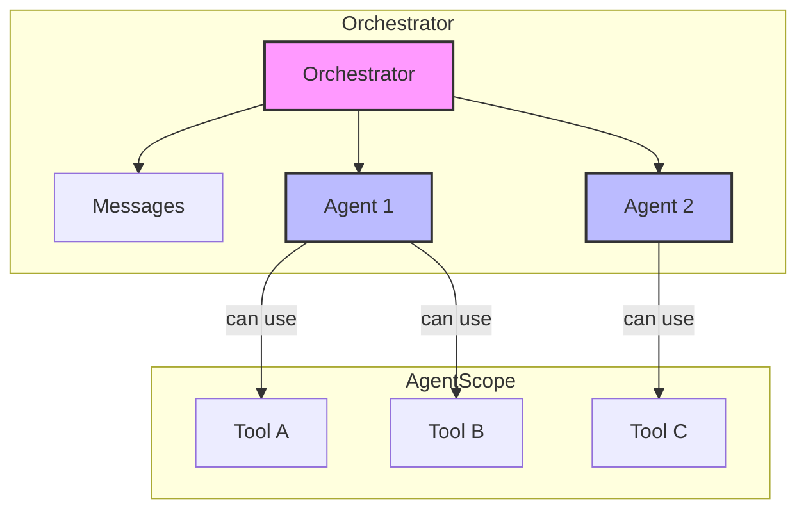

# Crabitat, agent workflow orchestrator

Crabitat is designed to coordinate and manage conversations between multiple AI agents. This system enables you to build sophisticated, autonomous workflows where specialized agents collaborate to solve complex problems, mirroring a team of human experts.

By defining roles, assigning tools, and setting a clear objective, you can create robust solutions for tasks ranging from code generation and data analysis to automated research and content creation.

## Core Concepts

The architecture is built upon a few simple concepts. Understanding these entities is key to leveraging the project.

- **Agent**: An `Agent` is the fundamental building block. It's an autonomous entity with a specific **persona** (defined by a system message), a set of **tools** it can use, and a connection to a language model (LLM). Think of an agent as a specialized team member, like a "Senior Rust Developer" or a "Code Reviewer."

- **Tool**: A `Tool` is a function that an `Agent` can execute to interact with the world outside the LLM. This could be anything from running shell commands, fetching data from a URL, or reading from a file system. Tools give agents the ability to perform actions and gather information. Tool use safety is a primary concern.

- **Message**: A `Message` is the unit of communication. Agents interact by sending messages to each other within a shared conversation history. This history provides the context for each subsequent step in the workflow.

- **Orchestrator**: The `Orchestrator` (also known as a Workflow Manager) is the central coordinator. It manages the entire process, holding the state of the conversation, routing messages between agents, and deciding which agent should act next based on a defined strategy.

## Type Relationships

The diagram below illustrates how these core types interact within the system. The `Orchestrator` contains a collection of `Agent`s and a history of `Message`s. Each `Agent` is configured with its own set of `Tool`s that it can invoke.


```mermaid
graph TD
    subgraph Orchestrator
        O[Orchestrator]
        M[Messages]
        A1[Agent 1]
        A2[Agent 2]
    end

    subgraph AgentScope
        T1[Tool A]
        T2[Tool B]
        T3[Tool C]
    end

    O --> M
    O --> A1
    O --> A2

    A1 -- can use --> T1
    A1 -- can use --> T2
    A2 -- can use --> T3

    style O fill:#f9f,stroke:#333,stroke-width:2px
    style A1 fill:#bbf,stroke:#333,stroke-width:2px
    style A2 fill:#bbf,stroke:#333,stroke-width:2px
```

## How It Works

The workflow follows a conversational loop managed entirely by the `Orchestrator`.

1.  **Initialization**: The user defines a set of agents, each with a specific persona and a set of available tools. These agents are added to the `Orchestrator`.
2.  **User Prompt**: The user kicks off the process with an initial task or question. This becomes the first message in the conversation history.
3.  **Agent Selection**: The `Orchestrator` determines which agent is best suited to respond to the latest message. This can be a simple round-robin rotation or a more complex logic based on the message content.
4.  **Agent Action**: The selected agent receives the conversation history. Based on its instructions and the current context, it can either:
    - Respond with a natural language message.
    - Decide to use one of its `Tool`s to perform an action.
5.  **Tool Execution**: If an agent decides to use a tool, the `Orchestrator` securely executes the corresponding function and returns the result as a new message in the conversation.
6.  **Loop or Terminate**: The process repeats from Step 3. The conversation continues until the task is completed or a termination condition is met (e.g., a specific "TERMINATE" keyword is produced by an agent).

## Example Usage

Below is a conceptual example of how you might define a simple two-agent workflow. This snippet is for illustrative purposes only to demonstrate the core ideas.

```rust
// This is a conceptual example and not intended to be runnable code.

// 1. Define Agents with their personas and tools.
let coder = Agent::new(
    "rust_coder",
    "You are a Senior Rust Developer. You write high-quality Rust code.",
    vec![Tool::new("execute_shell")]
);

let reviewer = Agent::new(
    "code_reviewer",
    "You review Rust code for quality, bugs, and adherence to best practices.",
    vec![] // The reviewer has no tools.
);

// 2. Create an orchestrator with the agents.
let mut orchestrator = Orchestrator::new(vec![coder, reviewer]);

// 3. Kick off the workflow with a user prompt.
let initial_prompt = "Write a Rust function that returns the n-th Fibonacci number.";
let final_result = orchestrator.run(initial_prompt);

// The orchestrator now manages the conversation until a final result is achieved.
println!("Workflow Result: {}", final_result);

```

## Project Management

```bash
➜  bd list

Found 9 issues:

crb-9 [P1] [task] open
  Create functional example workflow demonstrating agent configuration and execution

crb-8 [P2] [task] open
  Build Example Workflows

crb-7 [P2] [task] open
  Implement Termination Conditions

crb-6 [P2] [task] open
  Create Tool Integration Layer

crb-5 [P2] [task] closed
  Add Simple Agent Selection Strategy

crb-4 [P2] [task] closed
  Build the Orchestrator Workflow Loop

crb-3 [P2] [task] closed
  Create Agent Communication System

crb-2 [P2] [task] closed
  Implement Tool Execution Framework

crb-1 [P2] [task] closed
  Define Core Data Structures
  Assignee: deepseek
```

See `bd quickstart` for more.
