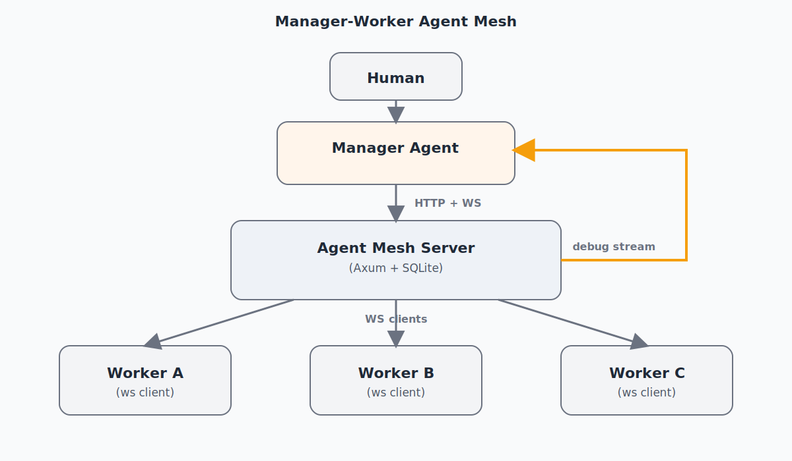

# PRD: Manager-Worker Agent Mesh (HTTP + WebSocket + SQLite + Astro UI)

## 1. Objective

Build a simple webserver that coordinates one manager agent and three worker agents.

- Human prompts the manager agent.
- Manager decomposes work and assigns tasks to workers.
- Workers execute tasks in isolated git worktrees or in configured external repos.
- Workers can message each other through the server.
- Manager can observe live debug logs to detect drift, stalls, and failures.
- Workers report chunk lifecycle status with token usage and timing telemetry.
- An Astro Web UI shows live agent activity, current chunks, and performance metrics.

This replaces complex distributed/p2p behavior with a centralized control plane.

## 2. High-Level Architecture



### Components

- Agent Mesh Server:
  - HTTP APIs for register, assign, send, status, logs.
  - WebSocket channels for realtime message delivery.
  - Persists agents, tasks, messages, and events in SQLite.
  - Tracks live connections in memory.
- Manager Agent:
  - Receives human prompt.
  - Plans and assigns sub-tasks.
  - Watches debug logs and task telemetry.
  - Produces final synthesized response.
- Worker Agents:
  - Pull task messages from WS.
  - Execute in `worktree` or `external_repo` mode.
  - Emit progress/results/errors.
  - Can message peers for handoffs/questions.
- Astro Web UI:
  - Reads status snapshot API for agents + chunks.
  - Displays current work, token usage, and timing metrics.
  - Supports operations/debug visibility for the manager and human operator.

## 3. Core Workflow

1. Start server.
2. Start manager + 3 workers.
3. Each agent registers and opens WebSocket.
4. Human sends prompt to manager.
5. Manager creates parent task and sub-tasks, then assigns work.
6. Workers execute and send `task.progress`, `task.handoff`, `task.result`, or `task.error`.
7. Workers emit chunk status telemetry (`start`, `update`, `complete`) with token/timing data.
8. Manager and human observe the Astro UI dashboard.
9. Manager monitors all events and adapts plan if needed.
10. Manager returns final answer to human.

## 4. Execution Modes

Each worker supports both modes and declares supported modes at registration.

### `worktree` mode

- Input: repo path + base branch.
- Worker creates branch `mesh/<task_id>-<agent_slug>`.
- Worker creates isolated worktree under a managed directory.
- Worker runs task in that directory.
- Worker reports changed files, commit hash (if commit created), and summary.
- Cleanup policy is configurable (`always`, `on_success`, `never`).

### `external_repo` mode

- Input: repo path from an allowlist.
- Worker operates directly in that repo path.
- Worker must report exact touched files and command history for audit.

## 5. API Contract (v1)

### `POST /v1/agents/register`

Registers an agent and returns `agent_id` plus auth token.

Request:
```json
{
  "name": "worker-a",
  "kind": "worker",
  "role": "implementation specialist",
  "model": "claude-sonnet-4-20250514",
  "capabilities": ["code", "tests"],
  "repo_modes": ["worktree", "external_repo"]
}
```

### `GET /v1/agents`

Returns roster with online/busy status.

### `POST /v1/tasks`

Creates task or sub-task.

### `POST /v1/messages/send`

Sends manager-worker or worker-worker message via server routing.

### `GET /v1/ws/:agent_id`

Realtime inbound channel for messages/events.

### `POST /v1/agents/heartbeat`

Updates liveness and current execution metadata.

### `GET /v1/logs`

Query structured logs/events with filters (`task_id`, `agent_id`, `level`, `since`).

### `GET /v1/ws/debug`

Realtime debug event stream for manager/observer clients.

### `GET /v1/status`

Returns a dashboard snapshot of agents and work chunks.

### `POST /v1/status/agents`

Upserts current worker/manager status so UI can show who is doing what.

Request:
```json
{
  "agent_id": "worker-a",
  "agent_name": "Worker A",
  "role": "implementation specialist",
  "state": "busy",
  "current_chunk_id": "chunk-42",
  "current_task": "Implement rate limiter middleware",
  "updated_at": "2026-02-18T10:04:12Z"
}
```

### `POST /v1/status/chunk-start`

Creates a chunk execution record when work begins.

Request:
```json
{
  "chunk_id": "chunk-42",
  "task_id": "task-9",
  "agent_id": "worker-a",
  "title": "Implement rate limiter middleware",
  "repo_mode": "worktree",
  "status": "running",
  "started_at": "2026-02-18T10:04:15Z"
}
```

### `POST /v1/status/chunk-update`

Sends incremental progress including token usage and timing.

Request:
```json
{
  "chunk_id": "chunk-42",
  "status": "running",
  "progress_message": "Added middleware and tests; running verification.",
  "token_usage": {
    "prompt_tokens": 1820,
    "completion_tokens": 640,
    "total_tokens": 2460
  },
  "timing": {
    "first_token_ms": 820,
    "llm_duration_ms": 9240,
    "execution_duration_ms": 18750,
    "end_to_end_ms": 29010
  },
  "updated_at": "2026-02-18T10:05:01Z"
}
```

### `POST /v1/status/chunk-complete`

Marks chunk completion/failure and sends final metrics.

Request:
```json
{
  "chunk_id": "chunk-42",
  "status": "completed",
  "summary": "Middleware added with tests and docs updated.",
  "token_usage": {
    "prompt_tokens": 1902,
    "completion_tokens": 702,
    "total_tokens": 2604
  },
  "timing": {
    "first_token_ms": 820,
    "llm_duration_ms": 9600,
    "execution_duration_ms": 20110,
    "end_to_end_ms": 31280
  },
  "completed_at": "2026-02-18T10:05:46Z"
}
```

## 6. Message Envelope

All message types use one envelope:

```json
{
  "message_id": "uuid",
  "task_id": "uuid",
  "parent_task_id": "uuid-or-null",
  "from": "manager-1",
  "to": "worker-a",
  "type": "task.assign",
  "reply_to": "uuid-or-null",
  "requires_ack": true,
  "payload": {},
  "created_at": "2026-02-18T10:00:00Z"
}
```

### Required message types

- `task.assign`
- `task.progress`
- `task.handoff`
- `task.result`
- `task.error`
- `agent.debug`
- `agent.heartbeat`

## 7. Task State Model

Task states:

- `queued`
- `assigned`
- `running`
- `blocked`
- `handoff`
- `completed`
- `failed`
- `canceled`

Manager is the source of truth for final state transitions.

## 8. Delivery and Reliability

- At-least-once delivery with message ACKs.
- Retry with backoff if ACK not received.
- Idempotency on `message_id`.
- Dead-letter status after retry limit; emit `task.error`.
- Heartbeat timeout marks worker as `offline` and triggers reassignment.

## 9. Debug Logging and Drift Detection

The server is the observability backbone.

### Structured logs

Every API call, message route, state transition, and worker heartbeat emits a structured event:

- `timestamp`
- `level` (`debug`, `info`, `warn`, `error`)
- `task_id`
- `message_id`
- `agent_id`
- `event_type`
- `summary`
- `metadata` (json)

### Manager visibility

- Manager can read historical logs (`GET /v1/logs`).
- Manager can subscribe to live logs (`GET /v1/ws/debug`).
- Manager can filter logs by task/agent to diagnose drift.

### Drift signals (v1)

- No heartbeat beyond timeout.
- Task stuck in `running` with no progress event.
- Repeated retries or repeated identical errors.
- Worker handoff loops (`A -> B -> A`).
- Divergent task summaries across workers.

When drift detected, manager may:

- request a worker self-check,
- reassign the task,
- pause a task,
- escalate to human.

## 10. SQLite Schema (v1)

```sql
CREATE TABLE agents (
  id TEXT PRIMARY KEY,
  name TEXT NOT NULL,
  kind TEXT NOT NULL,              -- manager | worker
  role TEXT NOT NULL,
  model TEXT NOT NULL,
  status TEXT NOT NULL,            -- online | offline | busy | idle
  capabilities_json TEXT NOT NULL,
  repo_modes_json TEXT NOT NULL,
  registered_at TEXT NOT NULL,
  last_heartbeat_at TEXT
);

CREATE TABLE tasks (
  id TEXT PRIMARY KEY,
  parent_task_id TEXT,
  title TEXT NOT NULL,
  status TEXT NOT NULL,
  assigned_to TEXT,
  created_by TEXT NOT NULL,
  repo_mode TEXT,
  repo_path TEXT,
  base_branch TEXT,
  worktree_path TEXT,
  created_at TEXT NOT NULL,
  updated_at TEXT NOT NULL
);

CREATE TABLE messages (
  id TEXT PRIMARY KEY,             -- message_id
  task_id TEXT NOT NULL,
  parent_task_id TEXT,
  from_id TEXT NOT NULL,
  to_id TEXT NOT NULL,
  type TEXT NOT NULL,
  reply_to TEXT,
  requires_ack INTEGER NOT NULL,
  payload_json TEXT NOT NULL,
  created_at TEXT NOT NULL,
  acked_at TEXT
);

CREATE TABLE events (
  id INTEGER PRIMARY KEY AUTOINCREMENT,
  timestamp TEXT NOT NULL,
  level TEXT NOT NULL,
  task_id TEXT,
  message_id TEXT,
  agent_id TEXT,
  event_type TEXT NOT NULL,
  summary TEXT NOT NULL,
  metadata_json TEXT NOT NULL
);

CREATE TABLE chunk_status (
  chunk_id TEXT PRIMARY KEY,
  task_id TEXT NOT NULL,
  agent_id TEXT NOT NULL,
  title TEXT NOT NULL,
  repo_mode TEXT,
  status TEXT NOT NULL,               -- queued | running | blocked | completed | failed
  progress_message TEXT,
  prompt_tokens INTEGER DEFAULT 0,
  completion_tokens INTEGER DEFAULT 0,
  total_tokens INTEGER DEFAULT 0,
  first_token_ms INTEGER,
  llm_duration_ms INTEGER,
  execution_duration_ms INTEGER,
  end_to_end_ms INTEGER,
  started_at TEXT,
  updated_at TEXT,
  completed_at TEXT
);
```

## 11. Proposed Project Layout

```
crates/ain-mesh/
├── Cargo.toml
└── src/
    ├── main.rs       # CLI: server | manager | worker
    ├── server.rs     # Axum routes, ws router, debug stream
    ├── store.rs      # SQLite CRUD + queries
    ├── protocol.rs   # message/task/event schemas
    ├── manager.rs    # planning + orchestration loop
    ├── worker.rs     # execution loop + repo operations
    ├── repo.rs       # worktree/external repo helpers
    └── llm.rs        # provider adapters (OpenAI/Anthropic/Ollama)

apps/mesh-ui/
├── package.json
├── astro.config.mjs
└── src/
    ├── pages/index.astro                  # dashboard UI
    ├── pages/api/status/index.ts          # GET status snapshot
    ├── pages/api/status/agents.ts         # POST agent status updates
    ├── pages/api/status/chunk-start.ts    # POST chunk start
    ├── pages/api/status/chunk-update.ts   # POST chunk updates
    ├── pages/api/status/chunk-complete.ts # POST chunk completion
    └── lib/status-store.ts                # in-memory status store (v1)
```

## 12. Non-Goals (v1)

- Full autonomous multi-manager cluster.
- Complex consensus or p2p transport.
- Deep historical analytics/BI dashboard beyond live operational monitoring.
- Automatic merge to main branch.

## 13. Verification Plan

1. Start server and 1 manager + 3 workers.
2. Submit one human prompt to manager.
3. Confirm manager emits `task.assign` for at least two workers.
4. Confirm worker-worker handoff message routing works.
5. Confirm `GET /v1/ws/debug` shows live structured events.
6. Post `chunk-start`, `chunk-update`, and `chunk-complete` events; verify status API aggregates correctly.
7. Open Astro UI and verify live agent/chunk cards update with token/timing data.
8. Kill one worker and verify timeout, reassignment, and error event.
9. Validate sqlite tables contain full audit trail.

## 14. Success Criteria

- 3 workers can run concurrently under manager direction.
- Manager can observe and diagnose via debug stream and logs.
- End-to-end task completes with auditable task/message/event history.
- Astro UI shows who is working on what with chunk-level token/timing telemetry.
- Failures are visible and recoverable via reassignment/escalation.
