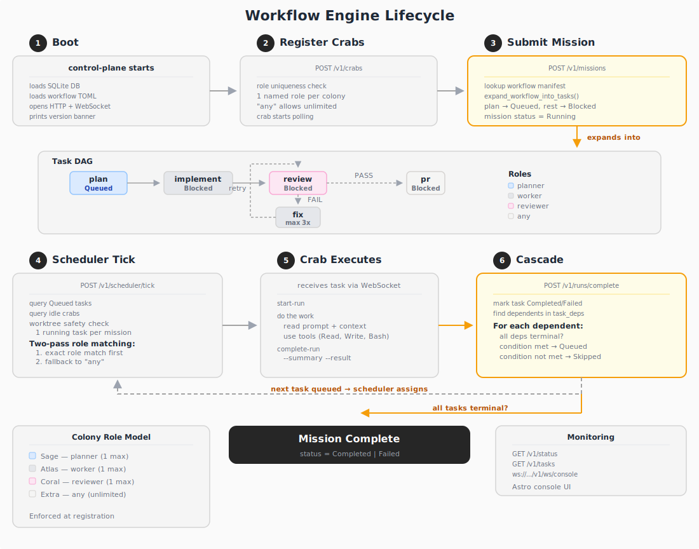

# Workflow Engine Architecture

## Overview

The workflow engine adds declarative DAG-based task orchestration to Crabitat. Instead of manually creating tasks and wiring them together, you define a workflow manifest in TOML and the control-plane handles expansion, scheduling, dependency resolution, and context forwarding automatically.

## Components

```
agent-prompts/              Control-Plane                  Crabs
├── workflows/              ┌─────────────────────┐        ┌───────────┐
│   └── dev-task.toml ───►  │ WorkflowRegistry    │        │ planner   │
├── do/                     │   .load()           │        │ worker    │
│   ├── plan.md             │   .get("dev-task")  │        │ reviewer  │
│   ├── implement.md        │                     │        └─────┬─────┘
│   ├── review.md           │ Scheduler           │              │
│   └── pr.md               │   role matching     │◄─── poll ────┘
│                           │   worktree safety   │
│                           │                     │
│                           │ Cascade             │
│                           │   dep resolution    │
│                           │   condition eval    │
│                           │   context fwd       │
│                           └─────────────────────┘
```

## Full Lifecycle



## Data Flow

### 1. Boot

The control-plane starts with `--prompts-path <dir>`. `WorkflowRegistry::load()` reads every `.toml` file in `<dir>/workflows/`, parses them into `WorkflowManifest` structs, and holds them in memory.

```bash
crabitat-control-plane serve --prompts-path ~/code/home/projectz/agent-prompts
```

### 2. Mission Creation with Workflow

```bash
curl -X POST http://localhost:8800/v1/missions \
  -H 'Content-Type: application/json' \
  -d '{"colony_id": "...", "prompt": "Fix issue #6", "workflow": "dev-task"}'
```

`expand_workflow_into_tasks()` runs:

1. For each step in the manifest, creates a Task row with:
   - `step_id` = step's `id` field
   - `role` = step's required role
   - `prompt` = rendered template from `prompt_file` (with `{{mission_prompt}}`, `{{worktree_path}}` filled in)
   - `status` = `Queued` if no deps, `Blocked` if has deps
2. For each `depends_on` entry, inserts into `task_deps(task_id, depends_on_task_id)`
3. If the step has a `condition` or `max_retries`, stores them in the task's `context` JSON under `_condition` and `_max_retries` keys

Result for `dev-task`:
```
plan       → Queued  (no deps)
implement  → Blocked (depends on plan)
review     → Blocked (depends on implement)
fix        → Blocked (depends on review, condition: review.result == 'FAIL')
pr         → Blocked (depends on review, condition: review.result == 'PASS')
```

### 3. Scheduling

`POST /v1/scheduler/tick` (or a timer) triggers `run_scheduler_tick_db()`:

1. Queries `Queued` tasks ordered by `created_at_ms`
2. Queries `idle` crabs
3. For each queued task:
   - **Worktree safety**: if another task in the same mission is `Running`, skip (all workflow steps share one worktree)
   - **Role matching** (two-pass):
     1. **Exact match first**: find an idle crab whose role matches the task role exactly (e.g. `reviewer` → `reviewer`)
     2. **Fallback to `any`**: if no exact match, accept a crab with role `any`, or a task with role `any`
   - If matched: sets task to `Assigned`, marks crab `busy`, sends `TaskAssigned` via WebSocket

This two-pass approach prevents a crab with role `any` from stealing work meant for a specialist (e.g. a worker grabbing a review task before the reviewer polls).

The `TaskAssigned` message includes the rendered prompt, accumulated context, and worktree path so the crab has everything it needs.

### 4. Cascade After Completion

When `POST /v1/runs/complete` fires, `cascade_workflow()` runs:

```
Task Completed/Failed
        │
        ▼
  Query task_deps for dependents
        │
        ├── For each dependent:
        │     ├── All deps terminal? ──no──► stay Blocked
        │     │
        │     ├── Evaluate condition
        │     │     ├── met ──► Queued (inject accumulated context)
        │     │     └── not met ──► Skipped (recurse cascade)
        │     │
        │     └── If task Failed ──► cascade failure to all dependents
        │
        ▼
  Check if all mission tasks are terminal
        ├── yes, any failed ──► mission = Failed
        ├── yes, none failed ──► mission = Completed
        └── no ──► mission stays Running
```

### 5. Condition Evaluation

Conditions are simple string comparisons: `step_id.field == 'value'`

The context map is built from run summaries of completed tasks in the mission. When a reviewer crab completes a run with:

```bash
crabitat-crab complete-run --run-id ... --status completed \
  --summary '...' --result PASS
```

The `--result PASS` produces a JSON summary `{"result": "PASS", "summary": "..."}`. The cascade extracts `review.result = "PASS"` into the context map, which is then checked against conditions like `review.result == 'PASS'`.

### 6. Context Forwarding

Each step receives accumulated context from its dependency chain. When a task transitions from `Blocked` to `Queued`, `build_accumulated_context()` collects the run summaries from all direct dependencies and formats them as:

```markdown
## plan
<summary of the plan step>

## implement
<summary of the implement step>
```

This is injected into the task's `context` field and substituted into the prompt template via `{{context}}`.

### 7. Fix/Review Retry Loop

The `fix` step has `condition = "review.result == 'FAIL'"` and `max_retries = 3`.

When `fix` completes:
1. `cascade_workflow()` detects `completed_step_id == "fix"`
2. Calls `requeue_review_after_fix()` which resets the `review` task to `Queued`
3. The reviewer re-runs, potentially producing `PASS` this time
4. If `PASS`: `pr` becomes `Queued`, new `fix` is `Skipped`
5. If `FAIL` again: `fix` re-queues (up to `max_retries`)

## Colony Role Model

### One Named Role Per Colony

Each colony enforces **at most one crab per named role** (`planner`, `worker`, `reviewer`). The role `any` is exempt — unlimited crabs can register as `any`.

```
Colony "crabitat-dev"
├── Sage    role: planner    ← only planner allowed
├── Atlas   role: worker     ← only worker allowed
├── Coral   role: reviewer   ← only reviewer allowed
├── Extra1  role: any        ← OK, unlimited
└── Extra2  role: any        ← OK, unlimited
```

If a second crab tries to register as `worker` in the same colony, the API returns:

```json
{"error": "role 'worker' is already taken in this colony by crab 'atlas-id'"}
```

This guarantees clear ownership: one agent is responsible for each role. For parallel work across missions, add more crabs with role `any` or spin up additional colonies.

### Registration Enforcement

Registration is serialized under a Mutex to prevent race conditions. The check-then-insert happens atomically:

1. Lock the registration mutex
2. Query: is there an existing crab with this role in this colony?
3. If yes → reject with 400
4. If no → upsert the crab row
5. Release the lock

Re-registering the **same** crab (same `crab_id`) with a different role is allowed — this is an upsert.

### Recommended Colony Setup

| Agents | Setup |
|--------|-------|
| 3 (production) | `planner` + `worker` + `reviewer` — full separation of concerns |
| 2 (minimal) | `worker` + `reviewer` — worker handles plan + implement + fix + pr |
| 1 (testing) | `any` — solo agent does everything sequentially |

## Database Schema

### task_deps

```sql
CREATE TABLE task_deps (
  task_id TEXT NOT NULL,
  depends_on_task_id TEXT NOT NULL,
  PRIMARY KEY (task_id, depends_on_task_id)
);
```

This is a junction table representing edges in the dependency DAG. A task cannot transition from `Blocked` to `Queued` until all rows in `task_deps` where it is `task_id` have `depends_on_task_id` tasks in a terminal state (`completed` or `skipped`).

### Extended columns

| Table | Column | Purpose |
|-------|--------|---------|
| missions | workflow_name | Which workflow manifest was used |
| missions | status | Pending/Running/Completed/Failed |
| missions | worktree_path | Shared worktree for all workflow steps |
| tasks | step_id | Links to workflow step id |
| tasks | role | Required crab role for scheduling |
| tasks | prompt | Rendered prompt template |
| tasks | context | Accumulated context + condition metadata |

## Files

| File | Role |
|------|------|
| `crates/crabitat-core/src/lib.rs` | `WorkflowManifest`, `WorkflowStep`, `WorkflowMeta`, `MissionStatus`, `evaluate_condition()` |
| `crates/crabitat-control-plane/src/main.rs` | `WorkflowRegistry`, `expand_workflow_into_tasks()`, `cascade_workflow()`, `run_scheduler_tick_db()` |
| `crates/crabitat-protocol/src/lib.rs` | Extended `TaskAssigned` with workflow fields |
| `crates/crabitat-crab/src/main.rs` | `--result` flag on `complete-run` |
| `agent-prompts/workflows/*.toml` | Workflow manifests |
| `agent-prompts/do/*.md` | Step prompt templates |
